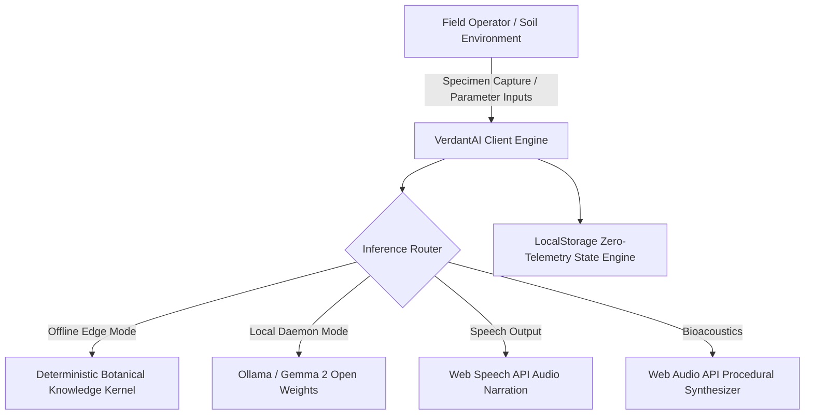

# VerdantAI — Open-Source Offline Flora & Agronomy Companion

> Decentralized botanical intelligence designed to minimize screen dependency and facilitate offline horticultural stewardship.  
> Developed for the **Hacktoberfest 2026 Open-Source AI Challenge (Week 1: Touch Grass)**.

[](https://dev.to/challenges/hacktoberfest-week1-2026-10-05)
[](https://dev.to/t/hf26challenge)
[](https://ai.google.dev/gemma)
[](LICENSE)
[](#)

---

## 1. Executive Summary

Modern software development often leads to prolonged screen exposure and disconnection from physical ecosystems. **VerdantAI** is an edge-native, open-source agronomy platform engineered with a strict design constraint: **minimize interface latency and compute duration to direct the user back to hands-on agricultural and ecological engagement.**

Powered by Google's **Gemma 2** open-weight model family and client-side botanical heuristics, VerdantAI provides localized agronomic guidance, specimen diagnostics, and field protocols without requiring continuous cloud connectivity or proprietary API tokens.

---

## 2. Core Architectural Pillars

### 2.1 Hyperlocal Sowing & Micro-Climate Engine
Calculates frost probability intervals, vernalization thresholds, and optimal sowing calendars across multiple global agricultural zones (Zone 5-11, South Asian plain agro-climates). All computations execute deterministically in the client environment.

### 2.2 Specimen Pathology & Diagnostic Pipeline
Provides localized symptom assessment for foliar chlorosis, fungal pathogens (such as *Erysiphales*), and insect defoliation vectors. The interface integrates the Web Speech API to provide hands-free audio narration of field remediation steps, enabling field operators to receive guidance without contaminating mobile hardware with soil.

### 2.3 Field Stewardship & Phenological Protocols
Replaces passive digital engagement with gamified, real-world horticultural operations—such as compost thermal monitoring, substrate aeration, mulch deployment, and avian biodiversity surveys.

### 2.4 Open-Weight Gemma 2 Integration
Features a flexible inference router supporting:
- Local daemon instances via **Ollama** (`gemma2:2b`, `gemma2:9b`).
- OpenAI-compatible local endpoints (**vLLM**, **LM Studio**, or **LocalAI**).
- On-device edge botanical knowledge fallback for 100% disconnected field environments.

### 2.5 Real-Time Procedural Sound Synthesizer
Generates ambient bioacoustics and weather sounds (canopy wind, precipitation, bird vocalizations) using procedural pink noise buffers and biquad filter modulation within the **Web Audio API**. This eliminates external MP3 network dependencies.

---

## 3. System Architecture



---

## 4. Why Open Innovation Matters

Proprietary, closed-source models introduce critical failure modes for decentralized agronomy:
- **Off-Grid Brittleness:** Agricultural plots, remote field stations, and hiking trails lack consistent cellular coverage. Closed APIs fail in these contexts.
- **Data Sovereignty & Privacy:** Agronomic records, food production logs, and geolocation stay on local hardware.
- **Zero Recurring Operational Cost:** Enables smallholders, educators, and community gardens to utilize advanced language models without token billing constraints.
- **Reproducibility & Adaptability:** Open weights allow localized fine-tuning for regional indigenous cultivars and endemic pests.

---

## 5. Getting Started

### 5.1 Standalone Execution
Clone the repository and open `index.html` directly in any standards-compliant browser. No package managers or build steps are required.

```bash
git clone https://github.com/Kunal-CodeLab/verdant-ai.git
cd verdant-ai

# Launch using any static HTTP server or open directly
npx serve .
```

### 5.2 Local Gemma 2 Daemon Setup (Optional)
To route queries to a local open-weight instance:

1. Install [Ollama](https://ollama.ai).
2. Pull the lightweight Gemma 2 parameter model:
   ```bash
   ollama run gemma2:2b
   ```
3. Open VerdantAI, navigate to **Engine Config** (`Sliders` icon), and verify the endpoint is configured to `http://localhost:11434`.

---

## 6. Challenge & Category Alignment

- **Event:** Hacktoberfest 2026 Open-Source AI Challenge (Week 1: "Touch Grass")
- **Target Category:** Best Use of Gemma (Google Open-Weight Model Family)
- **Official Tags:** `#devchallenge`, `#hf26challenge`

---

## 7. License

Distributed under the open-source [MIT License](LICENSE).
