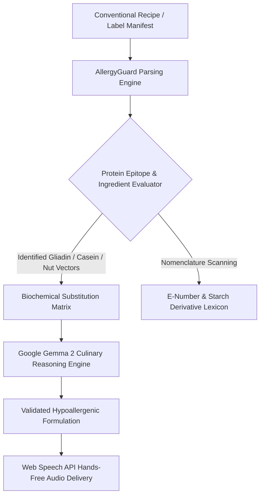

# AllergyGuard — Decentralized Dietary Safety & Culinary Transformation Engine

> Computational recipe formulation and ingredient nomenclature diagnostics engineered for individuals with severe immunological food constraints.  
> Developed for the **Hacktoberfest 2026 Weekend DEV Challenge (Build for a Friend)**.

[](https://dev.to/challenges/hacktoberfest-weekend-2026-10-01)
[](https://dev.to/t/weekendchallenge)
[](https://ai.google.dev/gemma)
[](LICENSE)
[](#)

---

## 1. Problem Statement & Motivation

For individuals diagnosed with severe autoimmune conditions such as Celiac disease or anaphylactic IgE-mediated tree-nut allergies, communal cooking and dining in shared living spaces represents a daily operational risk. Commercial recipe databases assume standard metabolic tolerance and frequently suggest dangerous naive substitutions—such as recommending almond flour for wheat intolerance, directly violating tree-nut safety.

**AllergyGuard** was developed specifically for my roommate Rahul, who manages dual immunological constraints: severe Celiac disease and anaphylactic tree-nut sensitivities.

The platform executes entirely client-side, translating conventional recipes into biochemically matched hypoallergenic formulations without reliance on external cloud APIs.

---

## 2. Technical Architecture



---

## 3. Core Modules

### 3.1 Recipe Safety Transformer
Accepts conventional culinary manifests and computes drop-in structural equivalents. Matches lipid percentages, hydrocolloid starch gelatinization curves, and umami glutamate profiles to preserve texture and flavor without triggering autoimmune or allergic cascades.

### 3.2 Industrial Label Diagnostics Engine
Evaluates commercial packaged goods ingredient declarations against a multi-token lexicon covering hidden gluten starches (E1400-E1450 derivatives, malt, spelt), bovine milk isolates (caseinates, whey protein), and tree-nut derivatives.

### 3.3 Hands-Free Audio Guidance
Integrates the Web Speech API to provide synthesized voice narration during culinary preparation, eliminating screen contamination from culinary ingredients.

### 3.4 Open-Weight Gemma 2 Integration
Leverages open-weight foundation models to explain food science principles—such as psyllium husk starch binding mechanics and seed-based lipid emulsification in high-temperature gravies.

---

## 4. Getting Started

### 4.1 Standalone Execution
Clone the repository and launch directly in any modern web browser:

```bash
git clone https://github.com/Kunal-CodeLab/allergy-guard.git
cd allergy-guard

# Run using any static HTTP server
npx serve .
```

---

## 5. License

Distributed under the open-source [MIT License](LICENSE).
